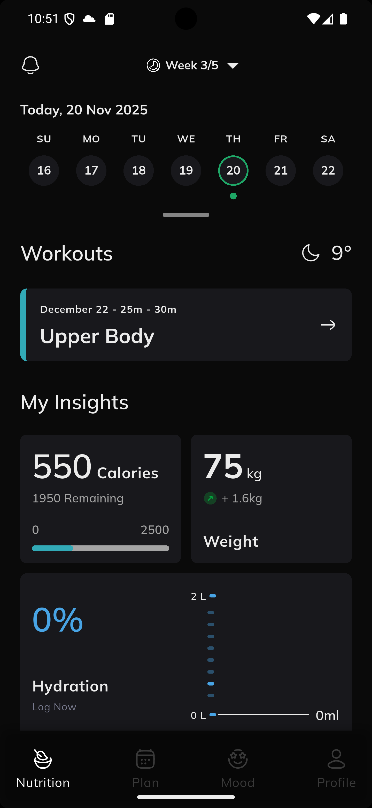
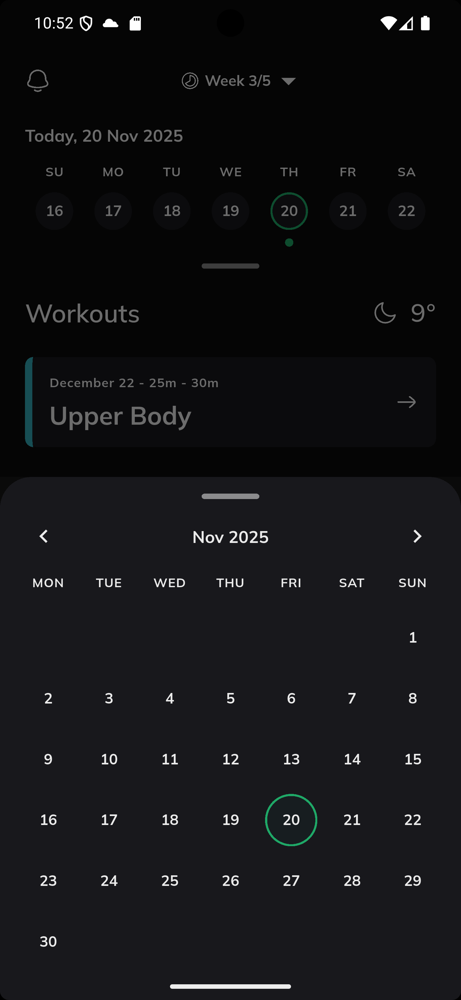
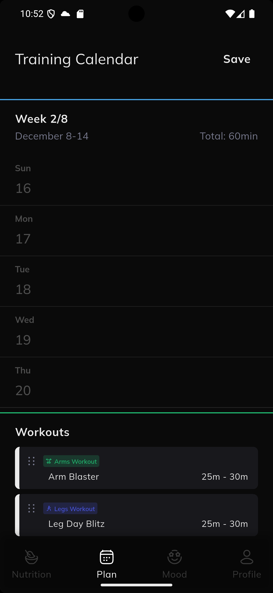
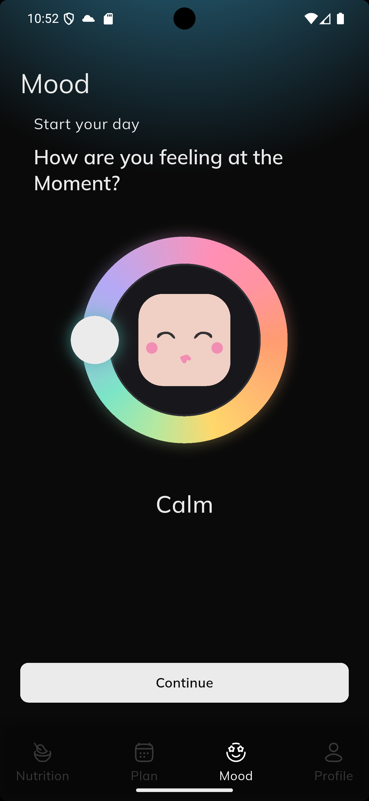

#  Flutter Interview Test Task 

## 1. Dependencies Used

*   **intl**: Used for date formatting and internationalization.
*   **flutter_screenutil**: To make the UI responsive across different screen sizes.
*   **flutter_svg**: To use SVG images in the application.
*   **flutter_bloc** & **bloc**: For state management using the BLoC pattern, separating business logic 


## 2. Project Structure

The project follows a feature-first architecture, with a core directory for shared components.

```
lib/
 ├── core/
 │   ├── constants/   # Contains application-wide constants like colors and image paths.
 │   ├── theme/       # Defines the application's theme.
 │   ├── utils/       # Holds utility functions, like date helpers.
 │   └── widgets/     # Contains reusable custom widgets used across multiple features.
 ├── features/      # Contains the different features of the application, separated by domain.
 │   ├── calendar/
 │   ├── dashboard/
 │   ├── home/
 │   ├── mood/
 │   └── training/
 └── main.dart      # The entry point of the application.
```

## 3. App Screenshots

<p align="center">
  
  
  
  
</p>

## 4. App Video

[Watch Video](https://drive.google.com/file/d/1gThczp9fM627nGOIFX-EIO4J84utj0ni/view?usp=sharing)


## 5. App APK

[Download APK](https://drive.google.com/file/d/1krZD-MG36VpFMV0_PoK8smnbVm71JdLr/view?usp=sharing)

